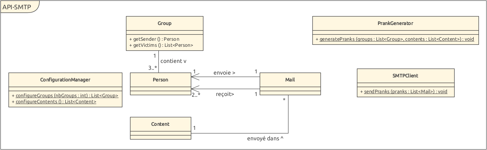

# Labo SMTP - Mélissa Gehring et Maëlle Vogel

## Introduction, ce qu'il faut savoir

Notre projet permet de créer des pranks. Un prank consiste à envoyer un mail forgé à une liste de victimes. L'expéditeur et les récepteurs sont
choisi de façon aléatoire parmi une liste prédéfinie par l'utilisateur de l'application. Un mail est dit forgé quand il usurpre l'identité
d'un tiers et contient de fausses informations, souvent dans un but malveillant.

## MockMock avec docker

Nous avons choisi de suivre les recommandations et d'utiliser MockMock plutôt qu'un autre programme au fonctionnement similaire.
Nous avons ensuite placé l'application MockMock dans un container Docker. Pour que MockMock puisse fonctionner dans un container il faut créer 
un Dockerfile à la racine du dossier. Dans ce Dockerfile nous devons donner les informations nécessaires pour lancer l'exécutif jar.

    FROM openjdk:11
    COPY target/MockMock-1.4.0.one-jar.jar /mock.jar
    WORKDIR /
    CMD ["java", "-jar", "/mock.jar"]

Ensuite il faut construire l'image avec ``docker build -t mockmock .`` pour cela il faut se trouver à la racine du dossier
où se trouve le fichier Dockerfile.
Après cela on peut lancer MockMock, mais il faut mapper les ports pour pouvoir utiliser l'interface web comme il se doit:

``docker run -d -p 8282:8282 -p 2525:25 mockmock``

Le port 25 ne sera pas utilisé car cela causait trop de problèmes (sur Debian 11).
Maintenant en allant sur [http://localhost:8282/](http://localhost:8282/) on a accès au serveur SMTP de MockMock.
Finalement, en lançant notre application réalisée pour le projet, on voit que les mails arrivent bien sur MockMock.

### Note

Sur Debian 11, docker prend presque 2 minutes à démarrer. Ce qui peut créer une erreur si on lance l'application prank trop tôt.

###Fonctionnement de MockMock

MockMock nous permet de tester nos pranks dans des conditions quasi réelles, sans pour autant que les emails soient rééellement
envoyés. Nous évitons ainsi de saturer les serveurs SMTP de la HEIG-VD ou de toute autre structure, mais pouvons tout de même 
tester le fonctionnement de notre programme. MockMock agit comme un serveur SMTP à qui on peut envoyer des requêtes, et qui
y répond, sans pour autant qu'il envoie les mails. Il se contente de simuler un échange rééel, et affiche ensuite les mails 
envoyés.

## Utilisation de notre application prank-SMTP

Quelques manipulations sont nécessaires au bon fonctionnement de notre application. En plus de lancer le container docker contenant MockMock,
il faut également fournir la liste des mails des victimes ciblées, et la liste des différents contenus de mails parmi lesquels on peut choisir.

Les victimes sont listées dans le fichier *victims.utf8* dans le dossier *config* à la racine. Il faut mettre une adresse mail par ligne.

La liste des contenus à envoyer dans les mails forgés se trouve dans le même dossier, dans le fichier *content.utf8*. Chaque contenu doit commencer par 
*Subject:* suivi de l'objet du mail, de deux retours à la ligne, et doit finalement contenir le corps du message.
Chaque contenu est séparé par la chaîne de charactères  **.

Une fois ces deux fichiers remplis, il faut lancer main.java avec un unique argument, un entier qui donne le nombre de groupes à créer. Notre programme s'occupera ensuite
de séparer les victimes en groupes, et d'envoyer un mail par groupe, choisissant un envoyeur parmi les membres du groupe, et un contenu aléatoirement parmi les différents contenus
précisés dans *content.utf8*. 

La valeur entière fournie en argument de notre programme doit être compatible avec le nombre de victimes listées dans le fichier *victims.utf8*, 
dans le sens où il faut un minimum de 3 victimes par groupe,
et le nombre de victimes doit être divisable par le nombre de groupes souhaité.
Les victimes seront alors distribuées aléatoirement en *n* groupes, *n* la valeur passée en argument.
Chaque groupe sera composé d'un envoyeur, choisi aléatoirement, et tous les autres membres du groupe seront donc les receveurs.
Notre application s'occupera ensuite de créer *n* mails, un par groupe, et de leur donner le bon format afin qu'il paraisse que l'envoyeur ait envoyé
aux receveurs le contenu choisi parmi la liste des contenus dans *contents.utf8*.

## Fonctionnement de notre application

Voilà une vue d'ensemble de nos classes et des méthodes les plus importantes :

Nous avons séparé notre application en 4 parties distinctes. 

### Configuration, dans le package *configuration* 

Cette partie concerne le traitement des fichiers *victims.utf8*
et *content.utf8*. La classe *ConfigurationManager.java*, une classe non instanciable, contient entre autres les deux 
méthodes publiques et statiques *configureGroups* et *configureContents*. Ces méthodes sont appelées par la méthode *main* et permettent d'initialiser les différentes entités
*Person*, *Group* et *Content* décrites plus bas.

### Mail, dans le package *mail*

Cette partie concerne le concept de mail, comme son nom l'indique. L'entité *Person* représente une personne, qui peut être envoyeuse ou receveuse. Une 
personne correspond à une ligne dans le fichier *victims.utf8*, et elle contient simplement l'adresse mail associée à cette personne.

L'entité *Group* correspond à une liste de *Person*. La première personne dans la liste est choisie par défaut comme étant l'envoyeur, et le reste des membres
sont les receveurs. Une liste de *n* groupes est créé en fonction du nombre passé en argument du programme, répartissant toutes les personnes équitablement dans chaque groupe.

L'entité *Content* correspond simplement à l'objet et au corps du mail. Il s'agit simplement de la chaine de caractère à envoyer dans un mail. Une liste de contenu est créée
au moment de la configuration, à partir du fichier *content.utf8*.

L'entité *Mail* correspond à un mail. Chaque groupe est associé à un mail, celui-ci possédant un envoyeur et une liste de receveurs correspondants au groupe associé. 
Un mail possède également un contenu.

### Prank, dans le package *prank*

Cette partie concerne la mise en place des différents pranks.
L'entité *PrankGenerator*, non instanciable, possède une unique méthode statique *generatePranks* qui permet de créer, à partir
d'une liste de groupes et d'une liste de contenus, le mail correspondant au groupe, avec un contenu choisi aléatoirement parmi la liste. Finalement,
*PrankGenerator* s'assure que les pranks soient joués (aka que les mails soient envoyés via la méthode sendPranks décrite plus bas).

### SMTPClient, dans le package *smtp*

Cette partie concerne la connexion et la communication avec le serveur SMTP de MockMock.
La classe *SMTPClient* est également non instanciable et possède une méthode publique statique *sendPranks qui permet simplement d'initier une connexion, 
puis d'envoyer la liste de mails en suivant le protocole SMTP.

Voilà un exemple type de communication entre notre application et le serveur SMTP de MockMock:
C pour les requêtes de notre application, le client, et S pour les réponses du serveur MockMock.

* C: EHLO localhost
* S: 220 COMPUTER ESMTP MockMock SMTP Server version 1.4
* S: 250-COMPUTER
* S: 250-8BITMIME
* S: 250 Ok
* C: MAIL FROM: mail@sender.com
* S: 250 Ok
* C: RCPT TO: mail@receiver1.com
* S: 250 Ok
* C: RCPT TO: mail@receiver2.com
* S: 250 Ok
* C: DATA
* S: 354 End data with \<CR>\<LF>.\<CR>\<LF>
* C: Content-Type: text/plain: charset="utf-8" 
    From: mail@sender.com 
    To: mail@receiver1.com, mail@receiver2.com 
Subject: Objet du mail  
    Corps du mail 
    .
* S: 250 Ok